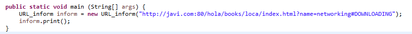
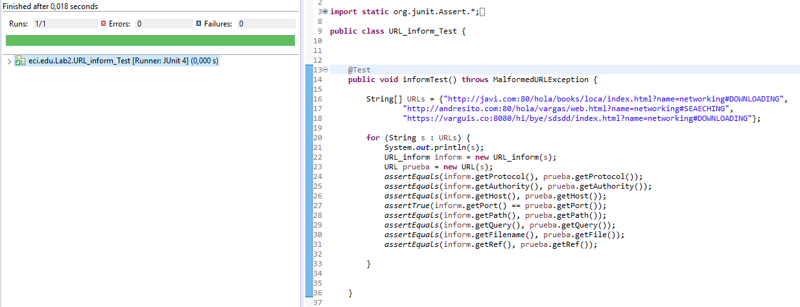
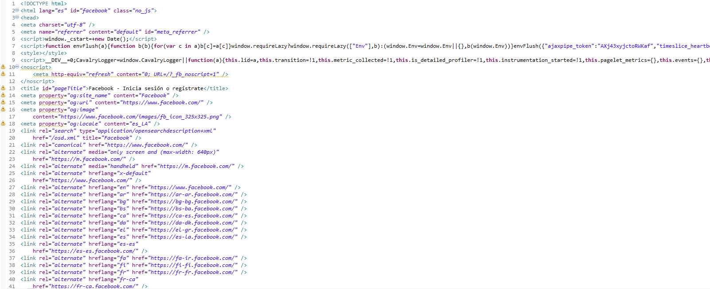
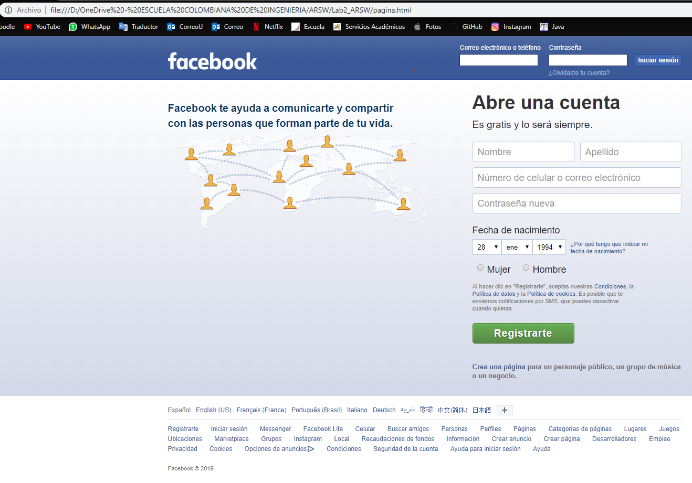
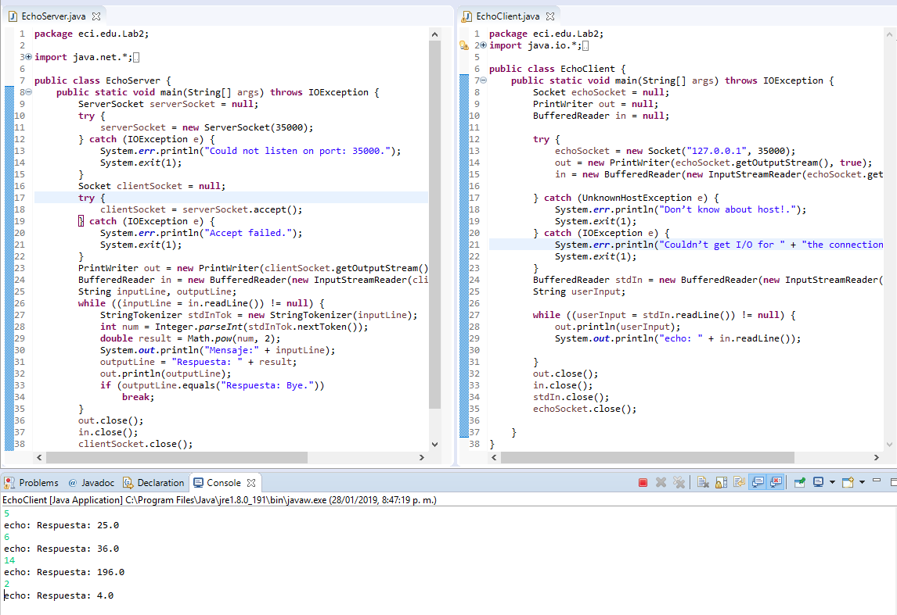
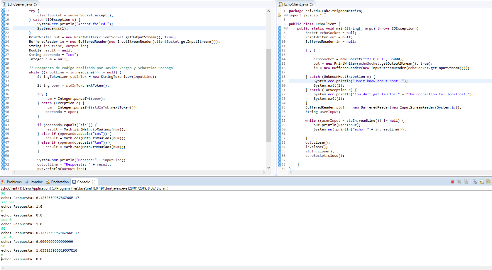
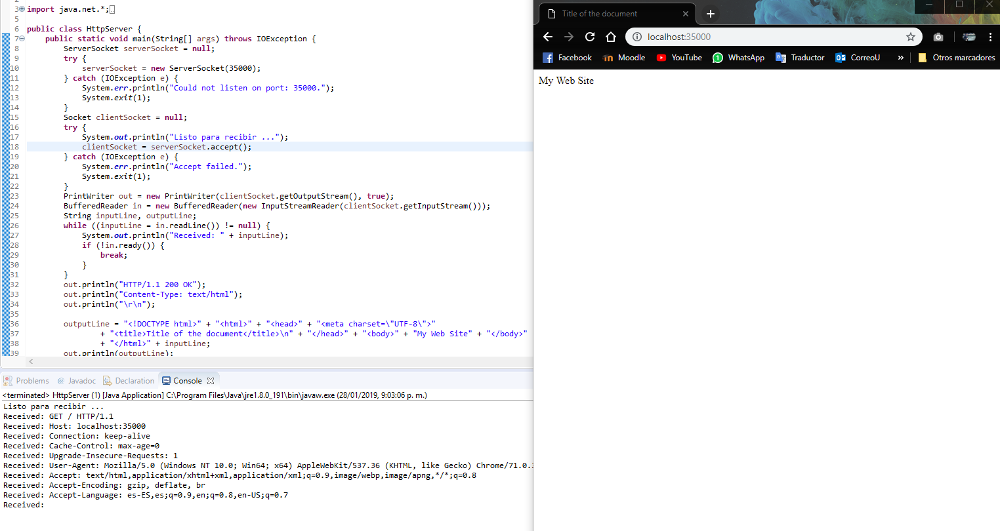
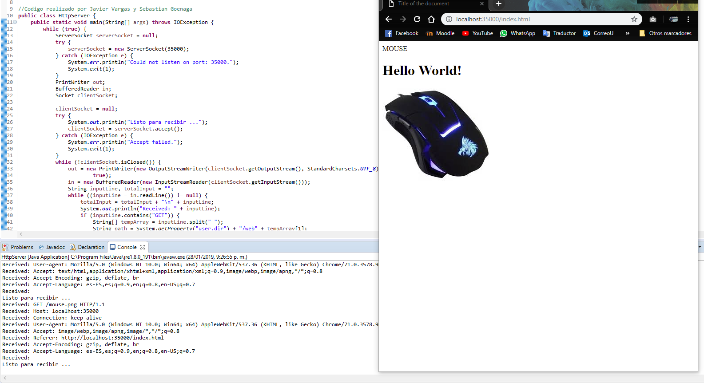
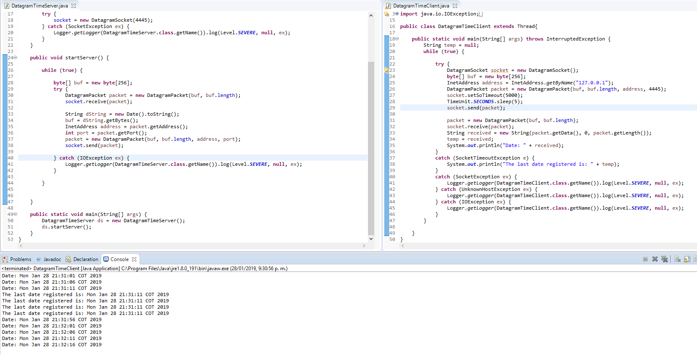

# Lab2 ARSW

## NETWORKING

The laboratory is about how we can represent connections between client-servers; using TCP, UDP and Sockets.

### Exercise 1
Here we print in console all methods we can use to reed information of an URL object on Java.

And I did tests for this class, it checks with three different URLs.


### Exercise 2
This class ask for an URL and save data in  pagina.html.

In this case I ran it with https://www.facebook.com



### Exercise 3

This server receive a number and return to the client the number squared. For can do it, we have to run server first and then the client.


### Exercise 4
This server receive a function, the function could be [cos, sin, tan] that represent de base trigonometric functions, with a number to apply de operation. It return to the client the result taking into consideration parameters given in the statement. By default the programs takes cos like principal function and when the function is defined  it is enough sending numbers only to the server, because it takes the lastes function used.


### Exercise 5
Here I added to the code that was given us and add
``` out.println("HTTP/1.1 200 OK"); out.println("Content-Type: text/html"); out.println("\r\n"); ```
and then we have a correct server answer:


### Exercise 6
This server is capable of receiving multiple requests and return solicited files.


### Exercise 7
I implemented datagrams using threads  in the client, because I want to control the frequency client request to server the date. When the server takes too long send the date, the client prints last date sent.

